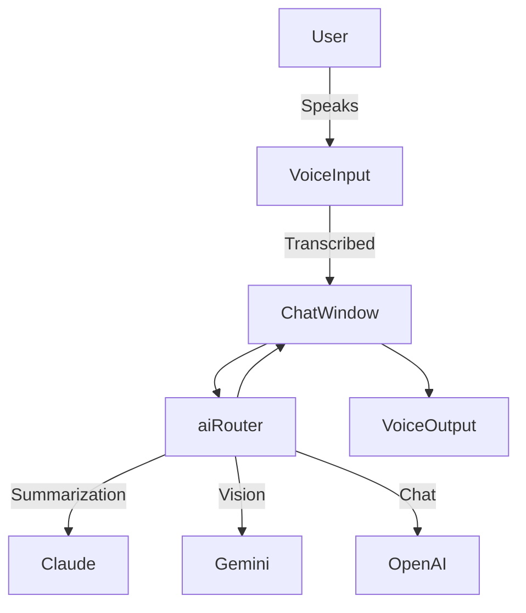

# AI Companion App for macOS — Architecture Overview

## Overview
This architecture document defines the complete technical blueprint for building a full-featured macOS AI Companion using:
- **Frontend**: Next.js (React-based framework)
- **Backend Services**: Supabase (for DB + Auth), Serverless API layer
- **AI Providers**: OpenAI GPT-4o, Claude.AI, Google Gemini 2.5 Flash
- **Features**:
  - Multimodal Input/Output (text & voice)
  - Multi-provider AI routing
  - Knowledge base from documents (PDF, PPT, Excel, etc.)
  - Real-time and asynchronous data processing

---

## 🔁 Folder Structure

```bash
ai-companion/
├── app/                       # Next.js app routes
│   ├── page.tsx              # Main UI (chat interface)
│   ├── settings/             # User settings
│   ├── upload/               # Document upload logic
│   └── api/                  # Custom serverless API endpoints
├── components/               # Reusable React components
│   ├── ChatWindow.tsx
│   ├── VoiceInput.tsx
│   ├── VoiceOutput.tsx
│   └── DocumentViewer.tsx
├── lib/                      # Utility libraries
│   ├── aiRouter.ts           # Routes to GPT/Claude/Gemini based on criteria
│   ├── knowledgeGraph.ts     # Interface with the vector DB
│   ├── documentParser.ts     # Extracts content from PDF, Excel, etc.
│   └── voiceUtils.ts         # Voice processing helpers
├── hooks/                    # Custom React hooks
│   ├── useSpeechToText.ts
│   └── useTextToSpeech.ts
├── styles/                   # Tailwind or custom CSS
├── supabase/                 # Supabase client and config
│   ├── client.ts
│   └── auth.ts
├── types/                    # TypeScript types
├── public/                   # Static assets
└── .env                      # API keys & secrets
```

---

## 🧠 Feature Breakdown

### 1. Multimodal Input
- **Text**: From ChatWindow
- **Voice**: Via `VoiceInput.tsx` and `useSpeechToText.ts`
- **Tech**: `Web Speech API` (browser) or native macOS input

### 2. Multimodal Output
- **Text**: Rendered in UI (ChatWindow)
- **Voice**: `VoiceOutput.tsx` using `useTextToSpeech.ts`
- **Switch**: UI toggle to switch between text/voice response

### 3. Knowledge Graph / DB
- **Supabase**:
  - Auth (email, social)
  - Postgres DB for metadata
- **Vector DB (e.g., Weaviate or pgvector)**:
  - Store embeddings from documents
- **`knowledgeGraph.ts`** handles querying & updates

### 4. Document Processing
- `upload/` route handles uploads
- `documentParser.ts` extracts text from:
  - PDF: pdf-parse
  - PPTX: pptx2json / libreoffice
  - Excel: sheetjs
- Parsed content converted to embeddings → stored in vector DB

### 5. Multi-AI Integration
- `aiRouter.ts` handles routing requests to:
  - **OpenAI** (via GPT-4o)
  - **Claude.ai** (Anthropic API)
  - **Gemini Flash** (Google PaLM/Gemini API)
- Criteria-based routing:
  - Model availability
  - Task type (vision, summarization, chat)
  - User preference

---

## ⚙️ Services & State Management

### State
- **Client-side state**: `useState`, `useReducer`, or `zustand` for UI/UX
- **Server state**:
  - Supabase for persistent storage (user sessions, history)
  - LocalStorage or IndexedDB for temporary client caching

### API Services
- All calls to AI providers via `/api/aiRouter.ts`
- Supabase REST/GraphQL endpoints via client SDK
- Document uploads → `/api/process-doc.ts`
- Authentication → `supabase/auth.ts`

---

## 🔐 Authentication
- **Supabase Auth** with:
  - Email/Password
  - OAuth (Google, Apple)
- Session tokens managed via cookies or JWTs
- `getUser()` middleware in API endpoints

---

## 📡 External API Integration
- **OpenAI GPT-4o**: `/v1/chat/completions`
- **Claude AI**: `https://api.anthropic.com/v1/complete`
- **Google Gemini**: `https://generativelanguage.googleapis.com/...`

All API keys are stored securely in `.env`

---

## 🔄 Data Flow Example



---

## 🛠 Development Notes
- Use Vercel for deployment of Next.js
- Use Supabase hosted Postgres with `pgvector` extension
- Build audio pipelines using `ffmpeg`, `Web Audio API`, `whisper.js`
- Schedule daily sync for knowledge base updates via CRON

---

## 🧪 Testing
- Unit tests: `Jest`
- Integration: `Playwright`
- Linting: `ESLint + Prettier`

---

## ✅ Next Steps
- [ ] Set up Supabase project & vector DB
- [ ] Configure API keys
- [ ] Build basic ChatWindow with routing
- [ ] Implement voice input/output components
- [ ] Integrate document parser + upload UI